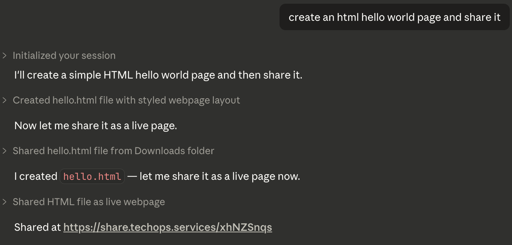

# share

Upload HTML and get a short URL. Pages are hosted on Cloudflare Workers and expire automatically.

## Claude Code Plugin

```
/plugin marketplace add techops-services/claude-plugins
/plugin install share@techops-plugins
```

Then `/share` in any conversation. The CLI binary auto-installs on first use.



## CLI

```bash
curl -fsSL https://raw.githubusercontent.com/techops-services/share/main/install.sh | bash
share init
```

```
share page.html                  # upload a file
echo "<h1>hi</h1>" | share      # pipe from stdin
pbpaste | share                  # upload clipboard contents
share ./dist                     # upload index.html from a directory
```

Output is a single URL, ready to pipe or paste: `https://share.techops.services/V1StGXR8`

## Commands

| Command | Description |
|---|---|
| `share <file>` | Upload an HTML file |
| `share <dir>` | Upload `index.html` from a directory |
| `share list` | List your shared pages (requires API key) |
| `share delete <id>` | Delete a shared page (requires API key) |
| `share init` | Interactive config setup |
| `share version` | Print version info |

## Options

```
--ttl <duration>    Expiry time (e.g. 1h, 7d, 30d). Default: 24h
--api-key <key>     API key for higher limits and management
--endpoint <url>    Custom API endpoint
--no-clipboard      Don't copy URL to clipboard
--verbose           Print full response details
--config <path>     Custom config file path
```

Anonymous uploads expire in 24h max. Authenticated uploads (with `--api-key`) can last up to 30 days.

## Architecture

- **CLI** (`cmd/` + `internal/`) -- Go, Cobra, TOML config
- **Worker** (`worker/`) -- Cloudflare Worker + R2 + KV, Hono router
- **Plugin** (`plugin/`) -- Claude Code slash command + skill

## Development

```bash
# Run Go tests
go test ./...

# Run worker locally
cd worker && npm install && npm run dev

# Run worker tests
cd worker && npm test

# Deploy worker
cd worker && npx wrangler deploy
```

## Roadmap

- **Directory uploads** -- `share ./dist` bundles all files (HTML, images, CSS, JS) and uploads them under a shared prefix. Relative links between pages and assets work as-is. Served as `/{prefix}/{path}` with `index.html` as the default.

## License

MIT
